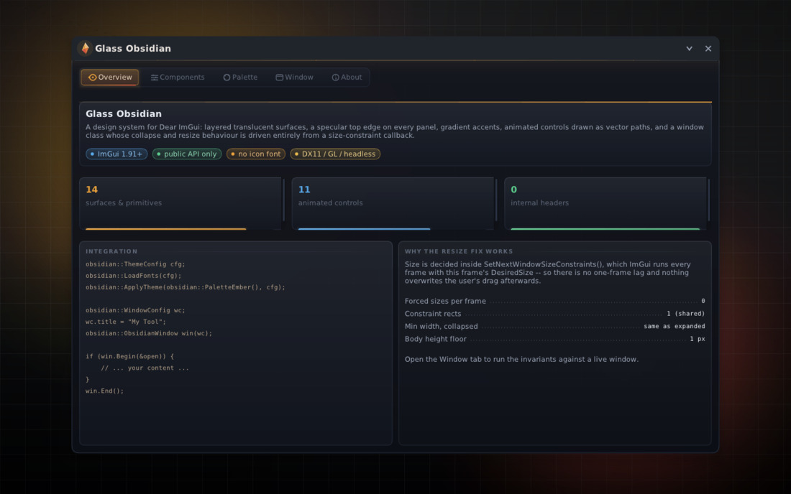
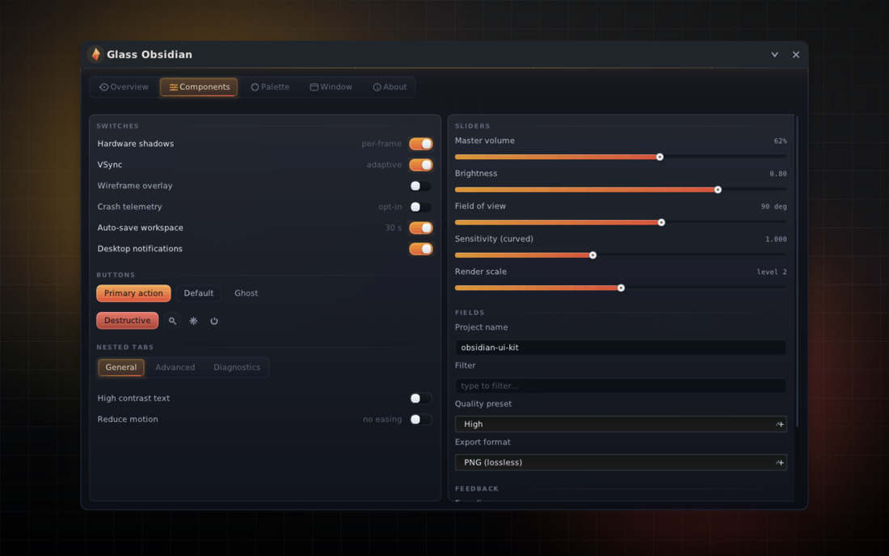
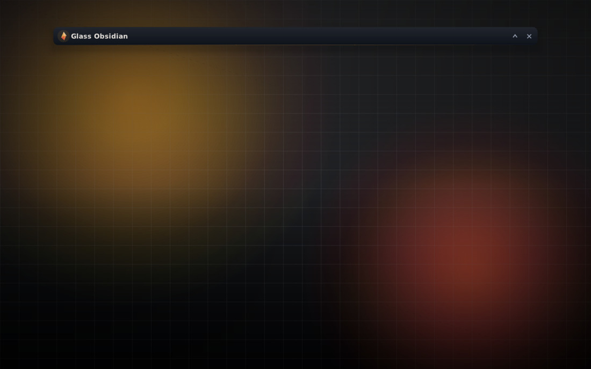
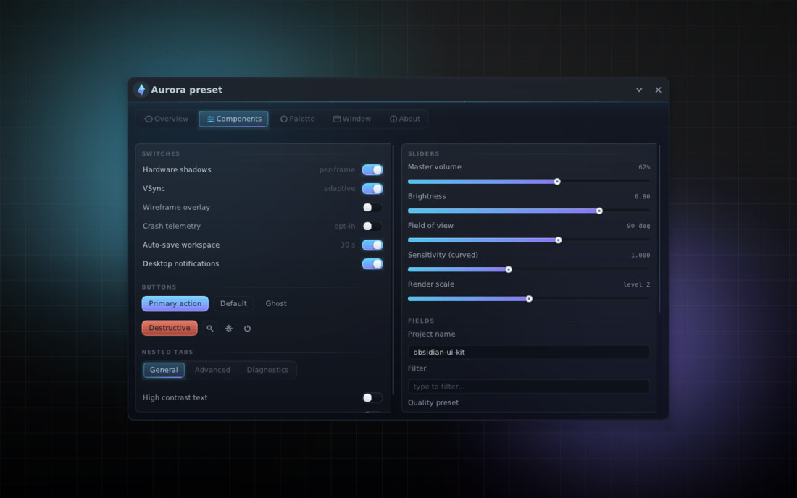

# Glass Obsidian

A **collapse-safe window class** and a **layered glass/obsidian theme** for
[Dear ImGui](https://github.com/ocornut/imgui) 1.91, written against the *public*
ImGui API. It exists to answer two problems at once:

1. **"My menu resizes wrong when it's collapsed."** Level-triggered size forcing
   (`SetNextWindowSize(..., Cond_Always)`), constraint rects that lag one frame
   behind the state they depend on, and min-widths that differ between collapsed
   and expanded states are the usual suspects. `obsidian::ObsidianWindow` removes
   all three by construction (see *The resize fix* below).
2. **"My ImGui UI looks like default ImGui."** `obsidian::ApplyTheme` plus the
   widget set in `glass.h` give you translucent layered surfaces, specular top
   edges, gradient accents and animated controls drawn as vector paths — no
   textures, no shaders, no icon font.

Everything in this repository is a **UI library and its verification harness**.
It reads no process memory, injects nothing and talks to no game.

---

## Proof, not promises

The library ships with a headless verification harness: it drives real ImGui
frames with a synthetic input state, checks 13 behavioural invariants of the
window state machine, then rasterises 13 screenshots at 1440×900 through a small
software rasteriser (`tools/soft_raster.h`) and writes them as PNGs. No GPU, no
window system, no network — just a C++17 compiler.

```sh
# one-liner build (no cmake needed)
g++ -std=c++17 -O2 -Iinclude -Ithird_party/imgui -Iapp -Itools \
    src/*.cpp app/demo_ui.cpp tests/headless_main.cpp \
    third_party/imgui/imgui*.cpp -o build/headless_tests

./build/headless_tests out        # exit code == number of failed invariants
```

```
== ObsidianWindow collapse/resize invariants ==
  [PASS] collapse settles on title bar height                 h=44.0 expected=44.0
  [PASS] expand restores exact pre-collapse size              860x560 -> 860x560
  [PASS] user resize survives collapse + expand               drag 1024x680 -> collapsed h=44 -> restored 1024x680
  [PASS] no sideways pop on expand (shared min width)         collapsed w=480, expanded w=480, min=480
  [PASS] settled size is bit-stable over 40 idle frames       860.000x560.000 vs 860.000x560.000
  [PASS] expanded drag is followed, not pinned                monotonic=1 final=1000 want=1000
  [PASS] 120 rapid toggles stay in bounds and settle correctly bounds=1 finite=1 final h=560 want=560
  [PASS] off-screen window is pulled back to a grabbable position pos=-788,-4 size=860x560
  [PASS] body is skipped while collapsed (0-cost overlay)     expanded=1 collapsed=0
  [PASS] QueueSize is one-shot and clamped to the minimums    immediate=480x300 after 30 frames=480x300
  [PASS] SetExpandedSize animates then lands exactly          from 560 mid 595 final 980x640
  [PASS] collapse interrupts a resize morph cleanly           collapsed h=44 restored=1040x660
  [PASS] ui_scale change rescales the window in place         1.00x=860 1.30x=1118 back=860

  13 / 13 invariants passed
```

Rendered screenshots land in `out/` (full-res PNG) and downscaled JPEG copies in
`preview/img/`; open **`preview/index.html`** for the annotated gallery. The
harness caught two real bugs while it was being written — a control glow that
escaped its child window's clip rect (visible as stray bars *outside* the window
on any backend), and barycentric weights applied to the wrong triangle corners in
the rasteriser itself (sheared glyphs). Both are fixed; the first was a genuine
library bug that a GPU backend would have shown too.

## Gallery

| | |
|---|---|
|  |  |
| *Overview — hero, stat cards, fill columns* | *Components — every widget in the set* |
|  |  |
| *Collapsed: exactly the title bar, body not submitted* | *Aurora preset at 0.80 surface opacity* |

## Quick start (your own UI)

```cpp
#include "obsidian/obsidian.h"

// once, after ImGui::CreateContext()
obsidian::ThemeConfig cfg;
cfg.ui_scale = 1.0f;
obsidian::LoadFonts(cfg);                       // Segoe UI / DejaVu / fallback
obsidian::ApplyTheme(obsidian::PaletteEmber()); // or Aurora/Verdant/Crimson, or your own

// every frame
obsidian::WindowConfig wc;
wc.title        = "My Tool";
wc.initial_size = ImVec2(860, 560);
obsidian::ObsidianWindow win(wc);               // keep this alive across frames

bool open = true;
if (win.Begin(&open)) {                         // false while collapsed: skip your body
    if (obsidian::ScopedPanel p("main", ImVec2(0, -1)); p) {
        ImGui::Text("hello, glass");
        static bool b = true;   obsidian::Toggle("shadows", &b);
        static float v = 62.f;  obsidian::Slider("volume", &v, 0.f, 100.f, "%.0f%%");
    }
}
win.End();
```

`ScopedPanel` is RAII (`if (ScopedPanel p(...); p) { ... }`); plain
`PanelBegin()/PanelEnd()` exist too. Panel heights: `y > 0` fixed, `y == 0`
fits content, `y < 0` fills the parent (safe inside `SameLine` columns).

Window API highlights: `Collapse() / Expand() / ToggleCollapse()`,
`SetExpandedSize()` (animated), `QueueSize()` (one-shot, clamped),
`SetCollapsed()`, layout save/restore, and an eased morph timeline that can be
interrupted at any frame without popping.

## The resize fix, in three rules

The classic broken pattern (which this project set out to fix) is:

```cpp
// BAD: level-triggered forcing fights the user's drag and lags state changes
ImGui::SetNextWindowSize(size, ImGuiCond_Always);
ImGui::SetNextWindowSizeConstraints(min_when_expanded, max);   // depends on state -> 1-frame lag
```

`ObsidianWindow` instead:

1. **Decide sizes inside `SetNextWindowSizeConstraints()`.** ImGui calls the
   callback *every* frame with this frame's `DesiredSize`, so there is no
   one-frame lag and nothing overwrites the user's drag afterwards. The callback
   is the single source of truth for min/max.
2. **One shared minimum width** for collapsed and expanded states, so expanding
   can never pop the window sideways; the collapsed height floor is exactly the
   title bar and the expanded floor is `max(title bar, min_height)`.
3. **Per-axis morph pins.** While a collapse/expand/resize animation runs, each
   axis is pinned to the eased interpolation between its recorded start size and
   its target; a pin releases only when the axis *arrives* (`|size - target|
   <= 0.5`), never on a timeline tick — which is what makes interrupted
   animations and 120-toggle stress runs settle exactly on target.

While collapsed the body is not submitted at all (`Begin()` returns false and
`End()` short-circuits), so a collapsed overlay submits ~0 widgets per frame.

## Layout of the repository

```
include/obsidian/   public headers (palette, theme, glass widgets, window, umbrella)
src/                implementation (public ImGui API only; imgui_internal never included)
app/                demo_ui (5 tabs, platform-agnostic) + Win32/DX11 and SDL2/GL3 mains
tests/              headless invariant suite + screenshot shooter
tools/              software rasteriser + tiny PNG writer (verification only)
third_party/imgui/  vendored Dear ImGui 1.91.1 core (no backends)
out/ , preview/     rendered proof (PNG / JPEG / gallery HTML)
```

## Building the windowed demos

The headless harness needs nothing. The windowed demos need a **full** ImGui
checkout (this repo vendors only the backend-free core) and either Win32+DX11 or
SDL2+GL:

```sh
cmake -B build -DOBSIDIAN_WITH_BACKENDS=ON -DOBSIDIAN_IMGUI_DIR=$HOME/imgui
cmake --build build
# -> obsidian_headless, and obsidian_demo_dx11 (Windows) or obsidian_demo_gl3
```

## Notes for integrators

* **Never `PushClipRectFullScreen()` inside a child window** for glows/shadows —
  it abandons the child's clip and the glow lands outside your window.
  `obsidian::SoftShadow` takes an explicit `spill_outside_window` flag that only
  the top-level window chrome uses.
* Re-bake fonts **outside** `NewFrame()/Render()`; the atlas is locked inside a
  frame. See the `ui_scale` handling in either demo main.
* The theme writes plain `ImGuiStyle` values, so stock ImGui widgets stay
  consistent next to the obsidian ones.

## License

MIT — see [LICENSE](LICENSE). Dear ImGui itself is MIT as well.
